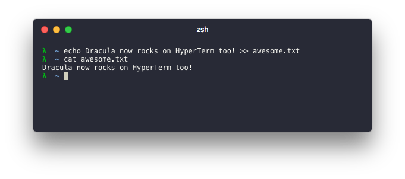

# Dracula for [HyperTerm](https://hyperterm.org)

> A dark theme for [HyperTerm](https://hyperterm.org).

<p align="center">
  <a href="">
    
  </a>
</p>

## Install

> All instructions can be found at [draculatheme.com/hyperterm](https://draculatheme.com/hyperterm).

Simply add `hyperterm-dracula` to the plugins list in your `~/.hyperterm.js` config file:

```js
module.exports = {

  config: { /*... */ },

  plugins: [
    "hyperterm-dracula"
  ]

};
```

## Team

This theme is maintained by the following person(s) and a bunch of [awesome contributors](https://github.com/dracula/hyperterm/graphs/contributors).

[](https://github.com/ythecombinator) |
--- |
[matt](https://github.com/ythecombinator) |

## License

[MIT License](./LICENSE.md)
